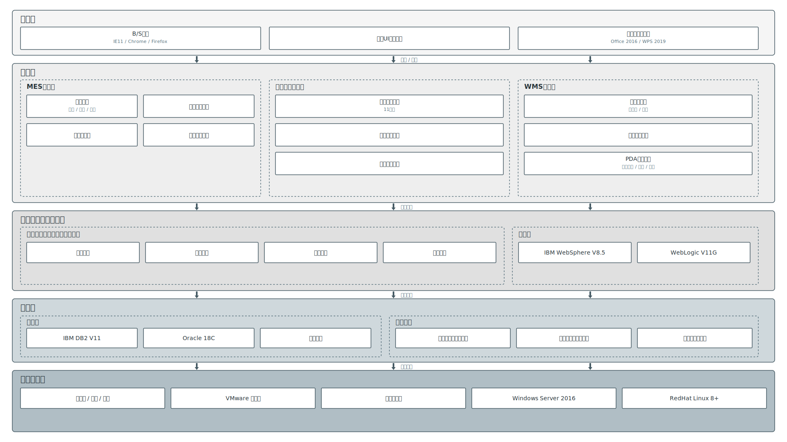

# Nanford-skills

一个持续沉淀个人高频工作流与实战方法论的 **Skill 资产仓库**。

> **核心价值**：不仅是提示词仓库，更是将“能力”模块化。它将日常可复用、可交付的工作流，整理成结构化的 Skill，旨在将 AI 转化为真实的生产力单元。

---

## 🛠️ 收录范畴

目前仓库聚焦于以下三大核心维度，持续整合已验证的实战技能：

| 维度 | 重点解决场景 | 价值目标 |
| :--- | :--- | :--- |
| **内容创作** | 爆款拆解、风格复刻、信息差提炼 | 提升内容的传播力与认知冲击 |
| **办公效率** | 文档/会议材料整理、知识库沉淀 | 极致提升日常琐事的产出效率 |
| **业务实战** | 售前方案、需求拆解、行业分析 | 强化复杂业务场景下的逻辑输出 |

## 🏛️ 官方规范与模板 (Anthropic Official)

本仓库通过 Git Submodule 引入了 [Anthropic Official Skills](https://github.com/anthropics/skills) 的核心规范与模板。

*   **同步路径**：`skills/official/`
*   **如何手动同步**：
    ```bash
    # 进入官方目录手动 pull
    cd skills/official
    git pull origin main
    # 或者从根目录一键更新
    git submodule update --remote
    ```
*   **核心参考**：
    *   [📜 官方 Skill 编写规范](https://github.com/anthropics/skills/blob/main/spec/agent-skills-spec.md) (GitHub 预览)
    *   [🛠️ 官方 Skill 结构模板](https://github.com/anthropics/skills/blob/main/template/SKILL.md) (GitHub 预览)
    *   *本地路径：`skills/official/spec/agent-skills-spec.md`*

---

## 📂 个人原创 Skill 索引

### 🔍 1. viral-article-analyzer
> **定位**：公众号爆款文章深度拆解系统

*   **核心价值**：不止于总结，更在于复盘传播背后的“情绪钩子”与“逻辑路径”。
*   **适用场景**：拆解对标账号、分析爆款原因、沉淀可复用的写作方法论。

### ✍️ 2. wechat-article-operator
> **定位**：公众号内容生产系统 (V3)

*   **核心价值**：覆盖选题评估 → 读者锚定 → 结构选型 → 正文写作 → 传播元素植入 → 运营拆解的全链路。
*   **适用场景**：热点解读、工具测评、趋势判断、观点文章、初稿升级改稿。
*   **V3 新增**：选题五维评估、读者画像锚定、五种正文结构自动推荐、三档深度控制、改稿诊断表、工具链衔接。
*   **推荐工具链**（可选，需额外安装对应 Skill）：

    | 环节 | 推荐 Skill | 来源 |
    | :--- | :--- | :--- |
    | 排版 | `wechat-article-formatter` | [iamzifei 公众号排版 Skill](https://github.com/iamzifei/wechat-article-formatter-skill)  |
    | 发布 | `baoyu-post-to-wechat` | [baoyu 社区 Skill](https://github.com/JimLiu/baoyu-skills) |
    | 封面图 | `baoyu-cover-image` | baoyu 社区 Skill |
    | 文中配图 | `baoyu-article-illustrator` | baoyu 社区 Skill |
    | 爆文分析 | `viral-article-analyzer` | 本仓库 ✅ |

### 🏗️ 3. prototype-orchestrator-pro
> **定位**：从模糊需求到可交互原型的自动化编排器

*   **核心价值**：需求归一化与可视化。直接将口语化需求转化为可交互的 HTML 原型。
*   **适用场景**：快速原型验证、产品规格评审、方案视觉化演示。

### 📐 5. svg-architecture-diagram
> **定位**：SVG 信息架构图生成器

*   **核心价值**：将任意架构文字描述转化为结构清晰、视觉专业的 SVG 架构图，无需外部工具，直接输出可渲染的矢量图。
*   **适用场景**：系统架构、业务流程、组织结构、数据流、技术选型方案等场景的可视化。
*   **8 种主题**：通用多彩 / 科技蓝 / 深色海洋 / 医疗健康 / 金融 / 森林绿 / 政企 / 暖色创意，根据行业自动匹配。
*   **双画布模式**：标准（1400×1000）和宽屏（1920×1080），适配不同展示需求。
*   **技术亮点**：使用几何拼接箭头替代 SVG marker，确保跨平台渲染一致性。

**效果预览**：



### 🎬 4. hootoolai-ppt
> **定位**：多主题企业级演示文稿生成器 + 自动配图

*   **核心价值**：将文本内容转化为 Bento Grid 布局的 HTML 演示文稿，并自动调用 AI 图片生成工具为幻灯片配图。输出 HTML + 素材文件夹，浏览器打开即可演示。
*   **适用场景**：科技发布、工作汇报、客户提案、培训材料、学术演示。
*   **6 种主题**：赛博暗夜 / 科技蓝 / 简洁汇报 / 暖光办公 / 软件公司 / 极简白，根据场景自动推荐。
*   **素材生成**：自动识别配图需求，调用 `baoyu-image-gen`、`baoyu-article-illustrator` 等 Skill 生成封面图、概念配图、数据图表；简单图标直接内联 SVG 绘制。
*   **推荐工具链**（可选，需额外安装对应 Skill）：

    | 环节 | 推荐 Skill | 来源 |
    | :--- | :--- | :--- |
    | 封面/配图生成 | `baoyu-image-gen` | [baoyu 社区 Skill](https://github.com/JimLiu/baoyu-skills) |
    | 矢量插画配图 | `baoyu-article-illustrator` | baoyu 社区 Skill |
    | 信息图/图表 | `baoyu-infographic` | baoyu 社区 Skill |
    | 封面大图 | `baoyu-cover-image` | baoyu 社区 Skill |

---

## 🏗️ 仓库目录结构

```text
Nanford-skills/
├── README.md
├── .gitignore                    # 项目忽略配置
└── skills/                       # 核心 Skill 目录
    ├── hootoolai-ppt/
    │   ├── SKILL.md              # 核心指令 (多主题 + 素材生成)
    │   ├── assets/               # HTML 模板 (CSS 主题系统 + JS 演示引擎)
    │   ├── examples/             # 完整演示示例
    │   └── references/           # 设计系统规范与幻灯片模板
    ├── prototype-orchestrator-pro/
    │   ├── SKILL.md              # 核心逻辑指令
    │   ├── agents/               # 智能代理配置
    │   ├── assets/               # 渲染模板与静态资产
    │   ├── examples/             # 最佳实践示例
    │   └── references/           # 设计规范与方法论参考
    ├── svg-architecture-diagram/
    │   ├── SKILL.md              # 核心指令 (JSON 模型 → SVG 生成)
    │   └── references/           # 配色主题定义 & 效果示例
    ├── viral-article-analyzer/
    └── wechat-article-operator/
        ├── SKILL.md              # V3 核心指令
        └── references/
            ├── article-structures.md  # 五种正文结构详解
            └── output-examples.md     # 风格示例与改稿诊断
```

---

## 🚀 使用与演进

### 统一标准
每个 Skill 遵循 **“单一职责”** 原则，包含明确的：
- `SKILL.md` (核心指令)
- `references/` (配套案例/模板)

### 演进路线
1.  **实用主义 (v0.1-v0.3)**：优先沉淀高频实操 Skill。
2.  **标准化 (Ongoing)**：统一命名规范、参数配置与版本记录。
3.  **体系化 (Future)**：形成覆盖全业务流的 AI 工作系统。

---

## 📜 版本更新记录

- **v0.6**：新增 `svg-architecture-diagram` SVG 架构图生成 Skill——8 种行业配色主题、双画布模式、几何拼接箭头、JSON 模型驱动的专业矢量架构图输出。
- **v0.5**：新增 `hootoolai-ppt` 多主题演示文稿生成 Skill——6 种配色主题、Bento Grid 布局、自动调用 AI 图片生成 Skill 配图、输出 HTML + 素材文件夹。
- **v0.4**：`wechat-article-operator` 升级至 V3——新增选题评估、读者画像、多结构选型、深度档位、改稿诊断、工具链衔接；精简冗余参考文件。
- **v0.3**：新增 `prototype-orchestrator-pro` 原型编排 Skill，重构 README 视觉结构。
- **v0.2**：新增 `wechat-article-operator` 写作升级 Skill。
- **v0.1**：仓库初始化，收录 `viral-article-analyzer` 拆解 Skill。

---

## 📄 License

本项目采用 [MIT License](LICENSE) 协议。你可以自由地学习、分享和修改这些 Skill，但请保留原作者的版权声明。

---

> Skill 不是一句提示词，而是一个能被复用的解决问题单元。
