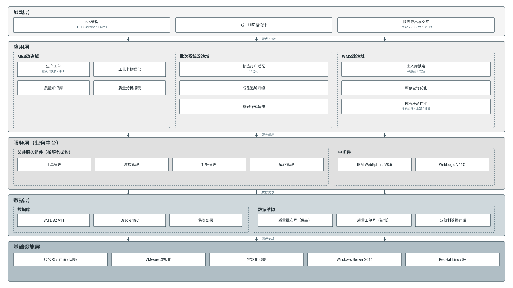

# Nanford-skills

一个持续沉淀个人高频工作流与实战方法论的 **Skill 资产仓库**。

> **核心价值**：不仅是提示词仓库，更是将“能力”模块化。它将日常可复用、可交付的工作流，整理成结构化的 Skill，旨在将 AI 转化为真实的生产力单元。

---

## 🛠️ 收录范畴

目前仓库聚焦于以下三大核心维度，持续整合已验证的实战技能：

| 维度 | 重点解决场景 | 价值目标 |
| :--- | :--- | :--- |
| **内容创作** | 爆款拆解、风格复刻、信息差提炼、视觉配图 | 提升内容的传播力与认知冲击 |
| **办公效率** | 文档/会议材料整理、PPT 规划与渲染、知识库沉淀 | 极致提升日常琐事的产出效率 |
| **业务实战** | 售前方案、投标应标、需求拆解、行业分析 | 强化复杂业务场景下的逻辑输出 |
| **工业自动化** | PLC 点位映射、站台化补表续表 | 将工程数据整理为可交付表格资产 |

## 🏛️ 官方规范与模板 (Anthropic Official)

本仓库通过 Git Submodule 引入了 [Anthropic Official Skills](https://github.com/anthropics/skills) 的核心规范与模板。

*   **同步路径**：`skills/official/`
*   **如何手动同步**：
    ```bash
    # 进入官方目录手动 pull
    cd skills/official
    git pull origin main
    # 或者从根目录一键更新
    git submodule update --remote
    ```
*   **核心参考**：
    *   [📜 官方 Skill 编写规范](https://github.com/anthropics/skills/blob/main/spec/agent-skills-spec.md) (GitHub 预览)
    *   [🛠️ 官方 Skill 结构模板](https://github.com/anthropics/skills/blob/main/template/SKILL.md) (GitHub 预览)
    *   *本地路径：`skills/official/spec/agent-skills-spec.md`*

---

## 📂 个人原创 Skill 索引

### 🔍 1. viral-article-analyzer
> **定位**：公众号爆款文章深度拆解系统

*   **核心价值**：不止于总结，更在于复盘传播背后的“情绪钩子”与“逻辑路径”。
*   **适用场景**：拆解对标账号、分析爆款原因、沉淀可复用的写作方法论。

### ✍️ 2. wechat-article-operator
> **定位**：公众号内容生产系统 (V3)

*   **核心价值**：覆盖选题评估 → 读者锚定 → 结构选型 → 正文写作 → 传播元素植入 → 运营拆解的全链路。
*   **适用场景**：热点解读、工具测评、趋势判断、观点文章、初稿升级改稿。
*   **V3 新增**：选题五维评估、读者画像锚定、五种正文结构自动推荐、三档深度控制、改稿诊断表、工具链衔接。
*   **推荐工具链**（可选，需额外安装对应 Skill）：

    | 环节 | 推荐 Skill | 来源 |
    | :--- | :--- | :--- |
    | 排版 | `wechat-article-formatter` | [iamzifei 公众号排版 Skill](https://github.com/iamzifei/wechat-article-formatter-skill)  |
    | 发布 | `baoyu-post-to-wechat` | [baoyu 社区 Skill](https://github.com/JimLiu/baoyu-skills) |
    | 封面图 | `baoyu-cover-image` | baoyu 社区 Skill |
    | 文中配图 | `baoyu-article-illustrator` | baoyu 社区 Skill |
    | 爆文分析 | `viral-article-analyzer` | 本仓库 ✅ |

### 🏗️ 3. prototype-orchestrator-pro
> **定位**：从模糊需求到可交互原型的自动化编排器

*   **核心价值**：需求归一化与可视化。直接将口语化需求转化为可交互的 HTML 原型。
*   **适用场景**：快速原型验证、产品规格评审、方案视觉化演示。

### 📐 4. svg-architecture-diagram
> **定位**：SVG 信息架构图生成器

*   **核心价值**：将任意架构文字描述转化为结构清晰、视觉专业的 SVG 架构图，无需外部工具，直接输出可渲染的矢量图。
*   **适用场景**：系统架构、业务流程、组织结构、数据流、技术选型方案等场景的可视化。
*   **8 种主题**：通用多彩 / 科技蓝 / 深色海洋 / 医疗健康 / 金融 / 森林绿 / 政企 / 暖色创意，根据行业自动匹配。
*   **双画布模式**：标准（1400×1000）和宽屏（1920×1080），适配不同展示需求。
*   **技术亮点**：使用几何拼接箭头替代 SVG marker，确保跨平台渲染一致性。

**效果预览**：



### 📡 5. ai-news-scout
> **定位**：AI 信息差日报生成工具

*   **核心价值**：通过 3 批并行搜索（大厂动态 / 社区开源 / 产品商业）高效采集全网 AI 新闻，自动去重合并后输出精炼的信息差日报。
*   **适用场景**：AI 日报生成、信息差选题、行业动态速览。
*   **核心特性**：
    *   3 批 Agent 并行搜索，覆盖官方公告、HN/Reddit/GitHub、融资与产品动态
    *   自动去重合并，按事件主体聚合多源报道
    *   6 类分类标签：模型发布 / 产品更新 / 开源动态 / 融资收购 / 政策监管 / 行业趋势
    *   精简 5 维分析 + 3 维评分（30 分制），信息密度高
    *   输出 `ai-news-{YYYY-MM-DD}.md` 日报文件，5 分钟掌握当日 AI 动态

### 🎬 6. hootoolai-ppt
> **定位**：多主题企业级演示文稿生成器 + 自动配图

*   **核心价值**：将文本内容转化为 Bento Grid 布局的 HTML 演示文稿，并自动调用 AI 图片生成工具为幻灯片配图。输出 HTML + 素材文件夹，浏览器打开即可演示。
*   **适用场景**：科技发布、工作汇报、客户提案、培训材料、学术演示。
*   **6 种主题**：赛博暗夜 / 科技蓝 / 简洁汇报 / 暖光办公 / 软件公司 / 极简白，根据场景自动推荐。
*   **素材生成**：自动识别配图需求，调用 `baoyu-image-gen`、`baoyu-article-illustrator` 等 Skill 生成封面图、概念配图、数据图表；简单图标直接内联 SVG 绘制。
*   **推荐工具链**（可选，需额外安装对应 Skill）：

    | 环节 | 推荐 Skill | 来源 |
    | :--- | :--- | :--- |
    | 封面/配图生成 | `baoyu-image-gen` | [baoyu 社区 Skill](https://github.com/JimLiu/baoyu-skills) |
    | 矢量插画配图 | `baoyu-article-illustrator` | baoyu 社区 Skill |
    | 信息图/图表 | `baoyu-infographic` | baoyu 社区 Skill |
    | 封面大图 | `baoyu-cover-image` | baoyu 社区 Skill |

### 📊 7. article-to-ppt-outline
> **定位**：长文本转结构化 PPT 大纲生成器（规划层）

*   **核心价值**：将长篇文档、业务教材转换为带有“视觉排版建议”和“讲师口语化逐字稿”的结构化大纲，为下游渲染提供逐页规划。
*   **适用场景**：快速备课、制作汇报演示文稿的大纲梳理阶段。
*   **推荐工具链**：大纲完成后交由 `text-to-ppt-pro` 渲染为可编辑 `.pptx` 文件。

### 👑 8. text-to-ppt-pro
> **定位**：专业 PPT 生成执行层

*   **核心价值**：接收结构化大纲，忠实渲染为可编辑 `.pptx` 文件；支持 13 种标准页型、4 套主题预设、备注区写入与自动质检。
*   **适用场景**：培训课件、项目汇报、立项汇报、方案宣讲等高规格演示需求。
*   **主题预设**：`dark_tech` / `business_blue` / `mckinsey_clean` / `warm_exec`，按受众与场景自动推荐。
*   **参考资产**：`layout-specs.md` 版式规范、`design-system.md` 设计系统、示例 PPT 参考稿。

### 📋 9. bid-preparation
> **定位**：标书响应文件制作全流程 Skill

*   **核心价值**：解析招标文件、匹配公司资料、按流程生成商务 + 技术响应文件，并组装为成品 DOCX。
*   **适用场景**：投标、应标、解标、偏离表编制、资格/符合性/评标导航表整理。
*   **核心能力**：
    *   招标文件结构化拆解与评分矩阵提取
    *   公司资料索引与匹配状态跟踪
    *   商务/技术响应大纲、偏离表、投标函等模板化产出
    *   辅助脚本：`extract_text`、`index_materials`、`build_response_docx`、`validate_bid_package` 等

### 🎨 10. minimal-narrative-sketch-scenes
> **定位**：极简手绘叙事小场景图像提示词生成器

*   **核心价值**：围绕任意主题生成高质量 16:9 横版插图提示词——多组松散动作小场景、强留白、轻快叙事感，介于儿童涂鸦与设计草图之间。
*   **适用场景**：文章配图、培训课件插图、社交媒体视觉、品牌故事草图风格表达。
*   **核心特性**：多变叙事结构模板、动作瞬间编排、统一手绘气质约束，避免精细插画或整齐图标化。

### ⚙️ 11. plc-station-db-mapper
> **定位**：西门子 PLC 站台化项目点位映射 Skill

*   **核心价值**：将 DB 截图、PDF 导出、Excel 导出或手动输入等多种原始格式，标准化为统一 Excel，并批量生成目标站台点位表。
*   **适用场景**：Task / Alarm / State 等类别点位的扩展、补表、续表。
*   **4 种输入路径**：DB 截图 → 标准化 Excel；PDF 导出；XLSX 导出；手动输入偏移与结构。
*   **原则**：以本次项目数据为准，不默认复用历史固定偏移模板。

### 🗺️ 12. architecture-diagram
> **定位**：无连线架构图视觉设计 Skill（`.agents/`）

*   **核心价值**：通过层级、分组、对齐与留白传达系统结构，默认不绘制箭头与连接线，输出克制、专业的架构视觉。
*   **适用场景**：系统总览、平台地图、方案蓝图、技术全景、分层能力视图（HTML / SVG / 幻灯片 / 图片）。
*   **设计原则**：以 containment 与 spatial organization 替代 connector web；仅在用户明确要求时添加最少必要连线。

### 🛒 13. 电商 Listing 生产工作流
> **定位**：商品理解、站点文案、套图生成、发布质检与刊登导出的三段式 Skill 工作流

| Skill | 工作阶段 | 核心产物 |
| :--- | :--- | :--- |
| `ecom-listing` | 商品事实、选项收集、站点文案、套图规划 | `listing.json`、`strategy.json`、`copy.json`、`image_jobs.json` |
| `ecom-image` | 无文字底图生成、准确文字图层合成 | `base_images/`、`final_images/`、渲染清单 |
| `ecom-publish` | 规则质检、视觉验收、平台字段映射 | `quality-report.json`、`listing_export.csv` |

*   **交互原则**：用户已说明的选项直接采用；缺失且会影响交付结果的选项使用原生结构化选择控件，不使用文本问卷。
*   **图片提供方**：Codex ImageGen、Qwen Image 3.0 Pro、Nano Banana 2、火山引擎 Seedream。
*   **续跑能力**：每个阶段落盘中间产物，上游修改后从最早受影响的位置继续。
*   **文案安全**：硬参数必须有来源，图片仅补充可直接观察事实，待确认属性不得进入公开文案。

---

## 🏗️ 仓库目录结构

```text
Nanford-skills/
├── README.md
├── .gitignore                    # 项目忽略配置
├── .agents/                      # Agent 专用 Skill
│   └── skills/
│       └── architecture-diagram/ # 无连线架构图视觉设计
└── skills/                       # 核心 Skill 目录
    ├── ecom-listing/             # 商品理解、文案与套图工单
    ├── ecom-image/               # 多提供方出图与文字合成
    ├── ecom-publish/             # 发布前质检与刊登导出
    ├── article-to-ppt-outline/
    │   └── SKILL.md              # 规划层 (长文本 -> PPT大纲)
    ├── text-to-ppt-pro/
    │   ├── SKILL.md              # 执行层 (大纲 -> .pptx 渲染)
    │   ├── assets/               # 主题预设
    │   └── references/           # 版式规范、设计系统、检查表、参考 PPT
    ├── bid-preparation/
    │   ├── SKILL.md              # 标书响应文件制作
    │   ├── scripts/              # 文本提取、资料索引、DOCX 组装与校验
    │   ├── templates/            # 投标函、偏离表、导航表等模板
    │   └── references/           # 解标参考卡片
    ├── minimal_narrative_sketch_scenes_skill/
    │   └── SKILL.md              # 极简手绘叙事小场景提示词
    ├── plc-station-db-mapper/
    │   ├── SKILL.md              # PLC 站台点位映射
    │   ├── scripts/              # 表格生成与 Excel 标准化
    │   └── reference/            # DB 截图、变量表等参考样例
    ├── hootoolai-ppt/
    │   ├── SKILL.md              # 多主题 HTML 演示 + 素材生成
    │   ├── assets/               # HTML 模板 (CSS 主题系统 + JS 演示引擎)
    │   ├── examples/             # 完整演示示例
    │   └── references/           # 设计系统规范与幻灯片模板
    ├── prototype-orchestrator-pro/
    │   ├── SKILL.md              # 需求 -> 可交互 HTML 原型
    │   ├── agents/               # 智能代理配置
    │   ├── assets/               # 渲染模板与静态资产
    │   ├── examples/             # 最佳实践示例
    │   └── references/           # 设计规范与方法论参考
    ├── ai-news-scout/
    │   ├── SKILL.md              # 3 批并行搜索 + 去重 + 分类
    │   └── references/           # 输出模板
    ├── svg-architecture-diagram/
    │   ├── SKILL.md              # JSON 模型 → SVG 架构图
    │   └── references/           # 配色主题定义 & 效果示例
    ├── viral-article-analyzer/
    └── wechat-article-operator/
        ├── SKILL.md              # V3 核心指令
        └── references/
            ├── article-structures.md  # 五种正文结构详解
            └── output-examples.md     # 风格示例与改稿诊断
```

---

## 🚀 使用与演进

### 电商工作流安装

将仓库中的三个电商 Skill 安装到 Codex 与 Claude Code：

```powershell
powershell -ExecutionPolicy Bypass -File ".\install-ecom-skills.ps1" -Agent both -Force
```

Codex 依次调用 `$ecom-listing`、`$ecom-image`、`$ecom-publish`；Claude Code 依次调用 `/ecom-listing`、`/ecom-image`、`/ecom-publish`。需要补充关键选项时使用 Agent 的原生选择控件；当前模式不提供该控件时，切换到支持结构化输入的交互模式后继续。

### 统一标准
每个 Skill 遵循 **“单一职责”** 原则，包含明确的：
- `SKILL.md` (核心指令)
- `references/` (配套案例/模板)

### 演进路线
1.  **实用主义 (v0.1-v0.3)**：优先沉淀高频实操 Skill。
2.  **标准化 (Ongoing)**：统一命名规范、参数配置与版本记录。
3.  **体系化 (Future)**：形成覆盖全业务流的 AI 工作系统。

---

## 📜 版本更新记录

- **v0.9**：新增 `bid-preparation` 标书响应文件制作 Skill（脚本 + 模板 + 参考卡片）；新增 `minimal-narrative-sketch-scenes` 极简手绘叙事小场景提示词 Skill；新增 `plc-station-db-mapper` 西门子 PLC 站台点位映射 Skill；新增 `.agents/skills/architecture-diagram` 无连线架构图视觉设计 Skill；升级 `text-to-ppt-pro` 为 PPT 执行层（13 种页型、4 套主题、`layout-specs` 版式规范、参考 PPT）；`article-to-ppt` 重命名为 `article-to-ppt-outline` 明确规划层定位。
- **v0.8**：新增 `article-to-ppt` 与 `text-to-ppt-pro`，完善 PPT 制作全链路工具；升级 `hootoolai-ppt` 至 V3，引入 PPT-Agent 认知设计逻辑。
- **v0.7**：新增 `ai-news-scout` AI 信息差日报 Skill——3 批 Agent 并行搜索、自动去重合并、6 类分类标签、精简 5 维分析 + 3 维评分、输出结构化日报文件。
- **v0.6**：新增 `svg-architecture-diagram` SVG 架构图生成 Skill——8 种行业配色主题、双画布模式、几何拼接箭头、JSON 模型驱动的专业矢量架构图输出。
- **v0.5**：新增 `hootoolai-ppt` 多主题演示文稿生成 Skill——6 种配色主题、Bento Grid 布局、自动调用 AI 图片生成 Skill 配图、输出 HTML + 素材文件夹。
- **v0.4**：`wechat-article-operator` 升级至 V3——新增选题评估、读者画像、多结构选型、深度档位、改稿诊断、工具链衔接；精简冗余参考文件。
- **v0.3**：新增 `prototype-orchestrator-pro` 原型编排 Skill，重构 README 视觉结构。
- **v0.2**：新增 `wechat-article-operator` 写作升级 Skill。
- **v0.1**：仓库初始化，收录 `viral-article-analyzer` 拆解 Skill。

---

## 📄 License

本项目采用 [MIT License](LICENSE) 协议。你可以自由地学习、分享和修改这些 Skill，但请保留原作者的版权声明。

---

> Skill 不是一句提示词，而是一个能被复用的解决问题单元。
